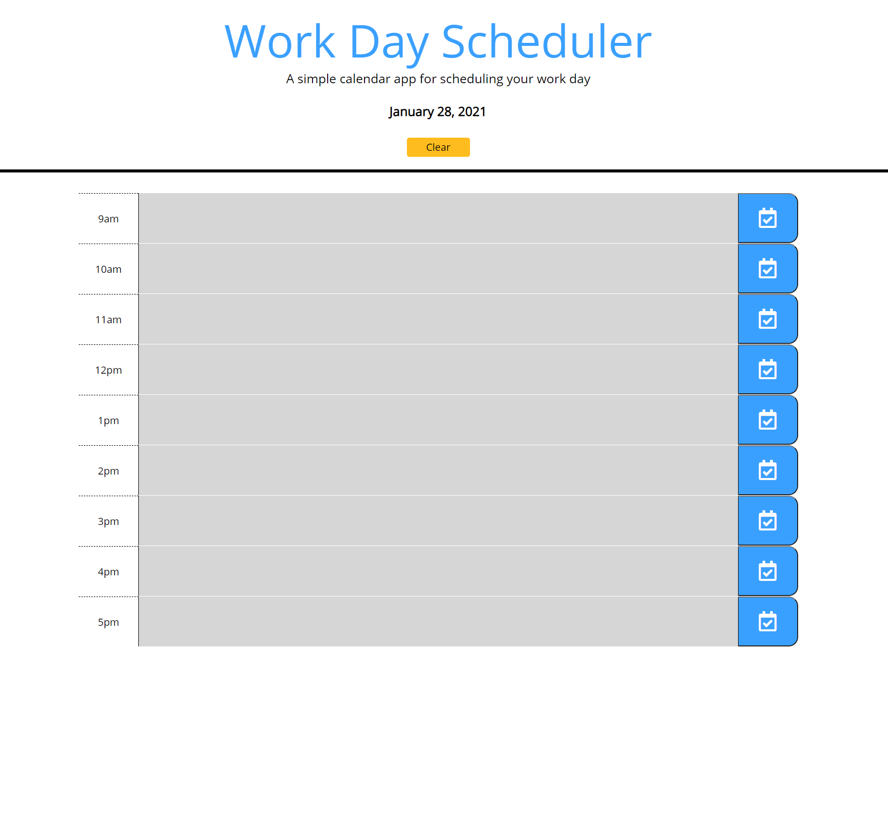

# Scheduler

## Description

This is a simple day planner to log workday activities. It is designed to display different colors based on what hour of the day it currently is. When events are in the future, the text box will be green. When it is the current hour, the text box will be a shade of red. When events are in the past, the text box will be gray. 

Building this day planner was a project for a coding boot camp to develop skills with using JQuery, local storage, and preventing the page to return to default when refreshed so to keep entries in the text boxes unless cleared. 

## Link to Live Day Planner

[Click here to access the Day Planner](https://mradamhorn.github.io/scheduler/)

## Screenshot of Final Product

